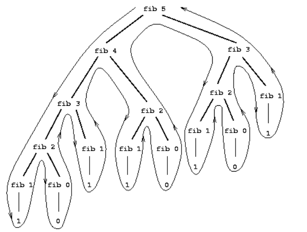

# 1Chapter1 

# Building Abstractions with Procedures 

##  1.1 The Elements of Programming

A powerful programming language is more than just a means for instructing a computer to perform tasks.we should pay particular attention to the means that the language provides for  combining simple ideas to form more complex ideas. Every powerful language has three mechanisms for  accomplishing this: 

- **primitive expressions**, which represent the simplest entities the language is concerned with 
- **means of combination**, by which compound elements are built from simpler ones, and 
- **means of abstraction**, by which compound elements can be named and manipulated as units 

### 1.1.1 Expressions

One kind of primitive expression you might type is a number. If you present Lisp with a number 486 and the interpreter will respond by printing

```scheme
486
```

Expressions representing numbers may be combined with an expression representing a primitive  procedure (such as **+** or *****) to form a compound expression that represents the application of the procedure 

```scheme
(+ 137 349)
486
(- 1000 334)
666
(* 5 99)
495
(/ 10 5)
2 
(+ 2.7 10)
12.7
```

Expressions such as these, formed by delimiting a list of expressions within parentheses in order to denote  procedure **application**, are called **combinations.** The leftmost element in the list is called the **operator**, and  the other elements are called **operands**. 

The convention of placing the operator to the left of the operands is known as **prefix notation**.

Its advantage is that it can accommodate  procedures that may take an arbitrary number of arguments, as in the following examples:

```scheme
(+ 21 35 12 7)
75
(* 25 4 12)
1200
```

And there is **no limit (in principle) to the depth** of such nesting and to the overall complexity of the expressions  that the Lisp interpreter can evaluate. 

```scheme
(+ (* 3
 		(+ (* 2 4)
 			(+ 3 5)))
	(+ (- 10 7)
 		6))
```

following a formatting convention known as **pretty-printing** ,in which each long combination is written so  that the operands are aligned vertically .

Even with complex expressions, the interpreter always operates in the same basic cycle: It reads an  expression from the terminal, evaluates the expression, and prints the result. This mode of operation is  often expressed by saying that the interpreter runs in a read-eval-print loop.  

### 1.1.2 Naming and the Environment

A critical aspect of a programming language is the means it provides for using names to refer to  computational objects. We say that the name identifies a **variable** whose **value** is the object. 

In the Scheme dialect of Lisp, we name things with **define** 

`(define size 2)`

causes the interpreter to associate the value 2 with the name **size** ， Once the name **size** has been  associated with the number 2, we can refer to the value 2 by name:

```scheme
size
2
(* 5 size)
10
```

Define is our language's simplest means of abstraction, for **it allows us to use simple names to refer to  the results of compound operations.**

### 1.1.3 Evaluating Combinations

To evaluate a combination, do the following:  

- Evaluate the subexpressions of the combination
- Apply the procedure that is the value of the leftmost subexpression (the operator) to  the arguments that are the values of the other subexpressions (the operands).  

Each combination is  represented by a node with branches corresponding to the operator and the operands of the combination  stemming from it. The terminal nodes (that is, nodes with no branches stemming from them) represent  either operators or numbers. 


In fact, the ``percolate values upward'' form of the evaluation rule is an example of a  general kind of process known as tree accumulation. 

We take care of the primitive cases by stipulating that

- the values of numerals are the numbers that they name 
- the values of built-in operators are the machine instruction sequences that carry out the  corresponding operations, and 
- the values of other names are the objects associated with those names in the environment. 

 the values of other names are the objects associated with those names in the environment. 

`(define x 3)` is not a combination because the purpose of the define is precisely to associate x with a value 

### 1.1.4 Compound Procedures

We have identified in Lisp some of the elements that must appear in any powerful programming language: 

- Numbers and arithmetic operations are primitive data and procedures. 
- Nesting of combinations provides a means of combining operations 
- Definitions that associate names with values provide a limited means of abstraction.  

Now we will learn about procedure definitions, a much more powerful abstraction technique by which a  compound operation can be given a name and then referred to as a unit. 


The general form of a procedure definition is 
$$
(define  (<name> <formal parameters>)<body>)
$$
The  <formal parameters> are the names used within the body of the procedure to refer to the corresponding arguments  of the procedure.  

we can even put more examples:

```scheme
(define (sum-of-squares x y)
 (+ (square x) (square y)))
 
 
(sum-of-squares 3 4)
```

Now we can use sum-of-squares as a building block in constructing further procedures 

```scheme
(define (f a)
 (sum-of-squares (+ a 1) (* a 2)))
(f 5)
```

Compound procedures are used in exactly the same way as primitive procedures. Indeed, one could not tell  by looking at the definition of sum-of-squares given above whether square was built into the  interpreter, like + and *, or defined as a compound procedure.

### 1.1.5 The Substitution Model for Procedure Application

We can assume that the mechanism for applying primitive procedures to arguments is built into the  interpreter. For compound procedures, the application process is as follows: 

- To apply a compound procedure to arguments, evaluate the body of the procedure with each  formal parameter replaced by the corresponding argument.  

Two points to be stressaed:

-  The purpose of the substitution is to help us think about procedure application, not to provide a  description of how the interpreter really works. Typical interpreters do not evaluate procedure  applications by manipulating the text of a procedure to substitute values for the formal parameters.  In practice, the ``substitution'' is accomplished by using a local environment for the formal  parameters. We will discuss this more fully in chapters 3 and 4 when we examine the  implementation of an interpreter in detail 
- Over the course of this book, we will present a sequence of increasingly elaborate models of how  interpreters work, culminating with a complete implementation of an interpreter and compiler in  chapter 5. The substitution model is only the first of these models -- a way to get started thinking  formally about the evaluation process. In general, when modeling phenomena in science and  engineering, we begin with simplified, incomplete models. As we examine things in greater detail,  these simple models become inadequate and must be replaced by more refined models. The  substitution model is no exception. In particular, when we address in chapter 3 the use of  procedures with ``mutable data,'' we will see that the substitution model breaks down and must be  replaced by a more complicated model of procedure application.

#### Applicative order VS normal order

​	An alternative evaluation model would not evaluate the operands until their values  were needed. Instead it would first substitute operand expressions for parameters until it obtained an  expression involving only primitive operators, and would then perform the evaluation. For Example：


In particular, the  evaluations of (+ 5 1) and (* 5 2) are each performed twice here, corresponding to the reduction of  the expression.This alternative **fully expand and then reduce** evaluation method is known as **normal-order evaluation**,  in contrast to the **evaluate the arguments and then apply**' method that the interpreter actually uses, which  is called **applicative-order evaluation**. 

### 1.1.6 Conditional Expressions and Predicates 

$$
|x| = 
	\begin{cases}
		x &\text{if  x > 0 }\\
		0 & \text{if  x = 0} \\
		-x & \text{if x < 0}
	\end{cases}
$$

This construct is called a case analysis, and there is a special form in Lisp for notating such a case  analysis. It is called **cond** (which stands for ``conditional''), and it is used as follows: 

```scheme
(define (abs x)
	(cond ((> x 0) x)
		  ((= x 0) 0)
		  ((< x 0) (-x))))
```

The general form of a conditional expression is 

```scheme
(cond (<p1> <e1>)
 	  (<p2> <e2>)
 	  ...
 	  (<pn> <en>))
```

Consisting of the symbol cond followed by parenthesized pairs of expressions` ( <p><e>) `called  clauses. The first expression in each pair is a predicate -- that is, an expression whose value is interpreted  as either true or false 

The predicate `<p1>`  is evaluated first. If its value is false,  then  is evaluated. This process continues until a  predicate is found whose value is true, in which case the interpreter returns the value of the corresponding  consequent expression `<e>` of the clause as the value of the conditional expression. If none of the 's is  found to be true, the value of the cond is undefined. 

Another way to write the absolute-value procedure is 

```scheme
(define (abs x)
	(cond ((< x 0) (-x))
	(else x)))
```

 `Else` is a  special symbol that can be used in place of the `<p>` in the final clause of a `cond`.

 Here is yet another way to write the absolute-value procedure 

```scheme
(define (abs x)
	(if (< x 0)
		(-x)
		x))
```

This uses the special form if, a restricted type of conditional that can be used when there are precisely  two cases in the case analysis. The general form of an if expression is 
$$
\text{(if <predicate> <consequent><alternative>)}
$$
some other primitive procedure


### 1.1.7 Example:Square Roots by Newton's Method

$$
\sqrt{x} = \text{the y such that y >= 0 and } y^2 = x
$$

we can define the square-root funcion as above.

The contrast between function and procedure is a reflection of the general distinction between describing  properties of things and describing how to do things, or, as it is sometimes referred to, the distinction  between declarative knowledge and imperative knowledge.

So we can write the basic procedure:

```lisp
(define (sqrt-iter guess x )
	(if (good-enough? guess x)
		guess
		(sqrt-iter(improve guess x)
		x)))
```

A guess is improved by averaging it with the quotient of the radicand and the old guess: 

```lisp
(define (improve guess x)
 (average guess (/ x guess)))
```

where:

```lisp
(define (average x y)
 (/ (+ x y) 2))
(define (good-enough? guess x)
 (< (abs (- (square guess) x)) 0.001))
```

Finally,we can get all the things.

### 1.1.8 Procedures as Black-Box Abstractions


​	A procedure definition should be able to **suppress detail**. The users of the procedure may not have  written the procedure themselves, but may have obtained it from another programmer as a black box. A  user should not need to know how the procedure is implemented in order to use it. 

#### Local names

This principle -- that the meaning of a procedure should be independent of the parameter names used by its  author -- seems on the surface to be self-evident, but its consequences are profound. The simplest  consequence is that the parameter names of a procedure must be local to the body of the procedure. For  example, we used square in the definition of good-enough? in our square-root procedure.

A formal parameter of a procedure has a very special role in the procedure definition, in that it doesn't  matter what name the formal parameter has.  

#### Internal definitions and block structure

we allow  a procedure to have internal definitions that are local to that procedure. For example, in the square-root  problem we can write 

```lisp
(define (sqrt x)
 (define (good-enough? guess x)
 	(< (abs (- (square guess) x)) 0.001))
 (define (improve guess x)
 	(average guess (/ x guess)))
 (define (sqrt-iter guess x)
 	(if (good-enough? guess x)
 		guess
 		(sqrt-iter (improve guess x) x)))
 	(sqrt-iter 1.0 x))
```

Such nesting of definitions, called **block structure**, is basically the right solution to the simplest name-packaging problem.   it is not necessary to pass x explicitly to each of these procedures. Instead, we allow x to be a free variable in the internal definitions, as shown below. Then x gets its value from the argument with which  the enclosing procedure sqrt is called. This discipline is called **lexical scoping** 

```lisp
(define (sqrt x)
 	(define (good-enough? guess)
 		(< (abs (- (square guess) x)) 0.001))
 	(define (improve guess)
 		(average guess (/ x guess)))
 	(define (sqrt-iter guess)
 		(if (good-enough? guess)
 			guess
 			(sqrt-iter (improve guess))))
 	(sqrt-iter 1.0))
```


## 1.2 Procedures and the Processes They Generate

### 1.2.1 Linear Recursion and Iteration

We begin by considering the factorial function, defined by 
$$
n! = n*(n-1)*(n-2)...3*2*1
$$
we can make a change and calculate the formula.
$$
n! = n*[(n-1)*(n-2)*...*3*2*1] = n*(n-1)!
$$
so we can easily write the codes as follows:

```lisp
(define (factorial n)
 	(if (= n 1)
 		1
 		(* n (factorial (- n 1)))))
```

We can describe the computation by saying that the counter and the product simultaneously change from  one step to the next according to the rule 
$$
product \leftarrow counter*product
$$

$$
counter \leftarrow counter +1
$$

and stipulating that n! is the value of the product when the counter exceeds n.and then we can use the substituting method to exchange the files.


Once again, we can recast our description as a procedure for computing factorials: 

```lisp
(define (factorial n)
 	(fact-iter 1 1 n))
(define (fact-iter product counter max-count)
 	(if (> counter max-count)
 		product
 		(fact-iter (* counter product)
 				   (+ counter 1)
 				   max-count)))
```


Consider the first process. The substitution model reveals a shape of expansion followed by contraction,  indicated by the arrow in figure 1.3. The expansion occurs as the process builds up a chain of deferred  operations (in this case, a chain of multiplications). The contraction occurs as the operations are actually  performed. This type of process, characterized by a chain of deferred operations, is called a recursive  process. Carrying out this process requires that the interpreter keep track of the operations to be performed  later on.

By contrast, the second process does not grow and shrink.At each step, all we need to keep track of, for any n, are the current values of the variables **product**, **counter**, and **max-count**. We call this an  **iterative process**. In general, an iterative process is one whose state can be summarized by a fixed number  of **state variables.**

One reason that the distinction between process and procedure may be confusing is that most  implementations of common languages (including Ada, Pascal, and C) are designed in such a way that the  interpretation of any recursive procedure consumes an amount of memory that grows with the number of  procedure calls, even when the process described is, in principle, iterative. As a consequence, these  languages can describe iterative processes only by resorting to special-purpose '**looping constructs** 'such  as `do, repeat, until, for, and while`. The implementation of Scheme we shall consider will execute an iterative process in constant space, even if the iterative  process is described by a recursive procedure. An implementation with this property is called **tail-recursive**. **With a tail-recursive implementation, iteration can be expressed using the ordinary procedure  call mechanism, so that special iteration constructs are useful only as syntactic sugar.** 

### 1.2.2 Tree Recursion

Another common pattern of computation is called tree recursion. As an example, consider computing the  sequence of Fibonacci numbers, in which each number is the sum of the preceding two.

In general, the Fibonacci numbers can be defined by the rule  
$$
Fib(n) = 
	\begin{cases}
	0 \text{    if n = 0} \\
	1 \text{ if n =1} \\
	Fib(n-1)+Fib(n-2) \text{  otherwise}\\
    
	\end{cases}
$$
We can immediately translate this definition into a recursive procedure for computing Fibonacci numbers: 

```lisp
(define (fib n)
	(cond ((= n 0) 0)
 		((= n 1) 1)
 		(else (+ (fib (- n 1))
 				 (fib (- n 2))))))
```



​	In general, the number of steps required by a tree-recursive process will be **proportional to the number of nodes in the tre**e, while the space required will be  **proportional to the maximum depth** of the tree.

We can also formulate an iterative process for computing the Fibonacci numbers. The idea is to use a pair  of integers a and b, initialized to Fib(1) = 1 and Fib(0) = 0, and to repeatedly apply the simultaneous  transformations
$$
a \leftarrow a+b\\
b\leftarrow a
$$

```lisp
(define (fib n)
 	(fib-iter 1 0 n))
(define (fib-iter a b count)
 	(if (= count 0)
 		b
 		(fib-iter (+ a b) a (- count 1))))
```

#### Example:Counting change

In contrast, consider the  following problem: How many different ways can we make change of $ 1.00, given half-dollars, quarters,  dimes, nickels, and pennies? More generally, can we write a procedure to compute the number of ways to  change any given amount of money? 

This problem has a simple solution as a recursive procedure. Suppose we think of the types of coins  available as arranged in some order. Then the following relation holds: 

The number of ways to change amount a using n kinds of coins equals 

- the number of ways to change amount a using all but the first kind of coin, plus 
- the number of ways to change amount a - d using all n kinds of coins, where d is the denomination  of the first kind of coin 

We can easily translate this description into a recursive procedure: 

```lisp
(define (count-change amount)
 	(cc amount 5))
(define (cc amount kinds-of-coins)
 	(cond ((= amount 0) 1)
 		((or (< amount 0) (= kinds-of-coins 0)) 0)
 		(else (+ (cc amount
 					 (- kinds-of-coins 1))
 				 (cc (- amount
 						(first-denomination kinds-of-coins))
 					 kinds-of-coins)))))
(define (first-denomination kinds-of-coins)
 	(cond ((= kinds-of-coins 1) 1)
 		((= kinds-of-coins 2) 5)
 		((= kinds-of-coins 3) 10)
 		((= kinds-of-coins 4) 25)
 		((= kinds-of-coins 5) 50)))
```

### 1.2.3 Orders of Growth

Let n be a parameter that measures the size of the problem, and let R(n) be the amount of resources the  process requires for a problem of size n. R(n) might measure the number of internal storage registers used, the number of  elementary machine operations performed, and so on. In computers that do only a fixed number of  operations at a time, the time required will be proportional to the number of elementary machine  operations performed.

We say that $R(n)$ has order of growth $\Theta(f(n))$, written $R(n) = \Theta(f(n))$ (pronounced  "**theta of f(n)**''), if there  are positive constants $k1$ and $k2 $independent of n such that 
$$
k_1f(n) \le R(n) \le k_2f(n)
$$
for **any** sufficiently large value of n. 

### 1.2.4 Exponentiation

Consider the problem of computing the exponential of a given number. We would like a procedure that  takes as arguments a base b and a positive integer exponent n and computes bn. One way to do this is via  the recursive definition  
$$
b^n = b*b^{n-1} \\
b^0 = 1
$$
which translates readily into the procedure 

```lisp
(define (expt b n)
 	(if (= n 0)
 	1
 	(* b (expt b (- n 1)))))
```

We can also take advantage of successive  squaring in computing exponentials in general if we use the rule 
$$
b^n = (b^{n/2})^2 \text{   if n is even} \\
b^n = b*b^{n-1} \text{   if n is odd}\\
$$
We can express this method as a procedure 

```lisp
(define (fast-expt b n)
	(cond ((= n 0) 1)
 		((even? n) (square (fast-expt b (/ n 2))))
 		(else (* b (fast-expt b (- n 1))))))
```

 Thus, the number of multiplications required for an exponent of n grows  about as fast as the logarithm of n to the base 2. The process has $\Theta(log n)$ growth. 

### 1.2.5 Greatest Common Divisors

The idea of the algorithm is based on the observation that, if r is the remainder when a is divided by b,  then the common divisors of a and b are precisely the same as the common divisors of b and r. Thus, we  can use the equation 
$$
GCD(a,b) = GCD(b,r)
$$
It is easy to express Euclid's Algorithm as a procedure: 

```lisp
(define (gcd a b)
	(if (= b 0)
 	a
 	(gcd b (remainder a b))))
```

**Lamé's Theorem**: If Euclid's Algorithm requires k steps to compute the GCD of some pair, then the  smaller number in the pair must be greater than or equal to the kth Fibonacci number 

### 1.2.6 Example:Testing for Primality

#### Searching for divisors

Since ancient times, mathematicians have been fascinated by problems concerning prime numbers, and  many people have worked on the problem of determining ways to test if numbers are prime. One way to  test if a number is prime is to find the number's divisors. The following program finds the smallest integral  divisor (greater than 1) of a given number n. It does this in a straightforward way, by testing n for  divisibility by successive integers starting with 2.

```lisp
(define (smallest-divisor n)
 (find-divisor n 2))
(define (find-divisor n test-divisor)
 (cond ((> (square test-divisor) n) n)
 ((divides? test-divisor n) test-divisor)
 (else (find-divisor n (+ test-divisor 1)))))
(define (divides? a b)
 (= (remainder b a) 0))
```

Consequently,  the number of steps required to identify n as prime will have order of growth $\Theta(\sqrt{n})$

#### The Fermat test

**Fermat's Little Theorem**: If n is a prime number and a is any positive integer less than n, then a raised to  the nth power is congruent to $ a$ modulo$ n$. 
$$
\text{if n is prime , any integer } a < n \text{ then}\\
a^n  = a\text{  (mod n)}
$$
To implement the Fermat test, we need a procedure that computes the exponential of a number modulo  another number: 

```lisp
(define (expmod base exp m)
 	(cond ((= exp 0) 1)
 		((even? exp)
 		(remainder (square (expmod base (/ exp 2) m))
 					m))
 		(else
 		(remainder (* base (expmod base (- exp 1) m))
 					m))))
```

The Fermat test is performed by choosing at random a number a between 1 and n - 1 inclusive and  checking whether the remainder modulo n of the nth power of a is equal to a. 

```lisp
(define (fermat-test n)
 	(define (try-it a)
 		(= (expmod a n n) a))
 	(try-it (+ 1 (random (- n 1)))))
```

The following procedure runs the test a given number of times, as specified by a parameter. Its value is  true if the test succeeds every time, and false otherwise 

```lisp
(define (fast-prime? n times)
 	(cond ((= times 0) true)
 		((fermat-test n) (fast-prime? n (- times 1)))
 		(else false)))
```

#### Probabilistic methods

The Fermat test differs in character from most familiar algorithms, in which one computes an answer that  is guaranteed to be correct. Here, the answer obtained is only probably correct. More precisely, if n ever  fails the Fermat test, we can be certain that n is not prime. But the fact that n passes the test, while an  extremely strong indication, is still not a guarantee that n is prime. What we would like to say is that for  any number n, if we perform the test enough times and find that n always passes the test, then the  probability of error in our primality test can be made as small as we like. 

## 1.3 Formulating Abstractions with Higher-Order procedures

Procedures that  manipulate procedures are called **higher-order procedures**. 

### 1.3.1 Procedures as Arguments

Consider the following three procedures. The first computes the sum of the integers from a through b 

```lisp
(define (sum-integers a b)
	(if (> a b)
 	0
 	(+ a (sum-integers (+ a 1) b))))

```

The second computes the sum of the cubes of the integers in the given range 

```lisp
(define (sum-cubes a b)
 (if (> a b)
 0
 (+ (cube a) (sum-cubes (+ a 1) b))))
```

The third computes the sum of a sequence of terms in the series 
$$
\frac{1}{1*3}+\frac{1}{3*5} +\frac{1}{5*7}+\cdots
$$
which converges to $\frac{\pi}{8}$ (very slowly): 

```lisp
(define (pi-sum a b)
 (if (> a b)
 0
 (+ (/ 1.0 (* a (+ a 2))) (pi-sum (+ a 4) b))))
```

These three procedures clearly share a common underlying pattern.  We could generate each of the procedures by filling in slots  in the same template: 

```lisp
(define (<name> a b)
 	(if (> a b)
 	0
 	(+ (<term> a)
 		(<name> (<next> a) b))))
```

Indeed, mathematicians long ago identified the abstraction of summation of a series and invented "sigma notation'' for example 
$$
\sum_{n = a}^{b} f(n) = f(a)+\cdots+f(b)
$$
The power of sigma notation is that it allows mathematicians to deal with the  concept of summation itself rather than only with particular sums 

We can do so readily in our procedural language by taking the common template shown  above and transforming the ``slots'' into formal parameters 

```lisp
(define (sum term a next b)
 	(if (> a b)
 	0
 	(+ (term a)
 	(sum term (next a) next b))))
```

Notice that sum takes as its arguments the lower and upper bounds a and b together with the procedures  term and next. For example, we can use it (along with  a procedure `inc` that increments its argument by 1) to define `sum-cubes`: 

```lisp
(define (inc n) (+ n 1))
(define (sum-cubes a b)
 (sum cube a inc b))
```

Once we have sum, we can use it as a building block in formulating further concepts. For instance, the  definite integral of a function f between the limits a and b can be approximated numerically using the  formula 
$$
\int_a^b f= [f(a+\frac{dx}{2})+f(a+dx+\frac{dx}{2})+f(a+2dx+\frac{dx}{2})+\cdots] dx
$$
for small values of dx. We can express this directly as a procedure: 

```lisp
(define (integral f a b dx)
 	(define (add-dx x) (+ x dx))
 	(* (sum f (+ a (/ dx 2.0)) add-dx b)
 		dx))
(integral cube 0 1 0.01)
.24998750000000042
(integral cube 0 1 0.001)
.249999875000001
```

### 1.3.2 constructing Procedures using Lambda

In general, $lambda$ is used to create procedures in the same way as define, except that no name is  specified for the procedure: 
$$
\text{( lambda  (< formal-parameters > ) < body > ) }
$$
The resulting procedure is just as much a procedure as one that is created using define. The only  difference is that it has not been associated with any name in the environment. In fact, 

`(define (plus4 x)(+ x 4))`

is equivalent to

`(define plus4(lambda (x) (+ x 4)))`


a lambda expression can be used as the operator in  a combination such as 

```lisp
((lambda (x y z) (+ x y (square z))) 1 2 3)
12
```

more generally, in any context where we would normally use a procedure name. 

#### Using let to create local variables


In writing a procedure to compute f, we would like to include as local variables not only x and y but also  the names of intermediate quantities like a and b. One way to accomplish this is to use an auxiliary  procedure to bind the local variables: 

```lisp
(define (f x y)
 	(define (f-helper a b)
 		(+ (* x (square a))
 		   (* y b)
 		   (* a b)))
 	(f-helper (+ 1 (* x y)) 
 			  (- 1 y)))
```

Using  let, the f procedure could be written as 

```lisp
(define (f x y)
 (let ((a (+ 1 (* x y)))
 		(b (- 1 y)))
 	(+ (* x (square a))
 		(* y b)
 		(* a b))))
```

The general form of a `let` expression is 


which can be thought of as saying 


 **A let expression is  simply syntactic sugar for the underlying lambda application** 

- $Let$ allows one to bind variables as locally as possible to where they are to be used 
- The variables' values are computed outside the let. This matters when the expressions that  provide the values for the local variables depend upon variables having the same names as the  local variables themselves 

### 1.3.3 Procedures as General Methods

The variables' values are computed outside the let. This matters when the expressions that  provide the values for the local variables depend upon variables having the same names as the  local variables themselves 

#### Finding roots of equations by the half-interval method

The half-interval method is a simple but powerful technique for finding roots of an equation f(x) = 0, where  f is a continuous function. The idea is that, if we are given points a and b such that $f(a) < 0 < f(b)$, then f must have at least one zero between a and b. let x be the average of a and b and compute  f(x). If $f(x) > 0$, then f must have a zero between a and x. If $f(x) < 0$, then f must have a zero between x and  b.the number of steps required grows as $\Theta(log( L/T))$, where L is the length of the original interval and T is the error tolerance.

```lisp
(define (search f neg-point pos-point)
 	(let ((midpoint (average neg-point pos-point)))
 		(if (close-enough? neg-point pos-point)
 			midpoint
 			(let ((test-value (f midpoint)))
 				(cond ((positive? test-value)
 						(search f neg-point midpoint))
 					  (negative? test-value)
 						(search f midpoint pos-point))
 					  (else midpoint))))))
```

To test whether the endpoints are ``close enough'' we can use a procedure similar to the one used in  section 1.1.7 for computing square roots: 

```lisp
(define (close-enough? x y)
 (< (abs (- x y)) 0.001))
```

Search is awkward to use directly, because we can accidentally give it points at which f's values do not  have the required sign, in which case we get a wrong answer. Instead we will use search via the  following procedure, 

```lisp
(define (half-interval-method f a b)
 	(let ((a-value (f a))
 		  (b-value (f b)))
 		(cond ((and (negative? a-value) (positive? b-value))
 				(search f a b))
 			  ((and (negative? b-value) (positive? a-value))
 				(search f b a))
 			  (else
 				(error "Values are not of opposite sign" a b)))))
```

#### Finding fixed points of functions

A number x is called a fixed point of a function f if x satisfies the equation f(x) = x. For some functions f we  can locate a fixed point by beginning with an initial guess and applying f repeatedly, 
$$
f(x),f(f(x)),f(f(f(x)))\dots
$$
until the value does not change very much. 

```lisp
(define tolerance 0.00001)
(define (fixed-point f first-guess)
  (define (close-enough? v1 v2)
 	(< (abs (- v1 v2)) tolerance))
  (define (try guess)
 	(let ((next (f guess)))
 		(if (close-enough? guess next)
 			next
 			(try next))))
 (try first-guess))
```

 Computing the square root  of some number x requires finding a y such that y2 = x. Putting this equation into the equivalent form y =  x/y, we recognize that we are looking for a fixed point of the function58 y x/y, and we can therefore try  to compute square roots as 

```lisp
(define (sqrt x)
 (fixed-point (lambda (y) (/ x y))
 				1.0))
```

Unfortunately, this fixed-point search does not converge. In some case,it will make the situation named oscillating about the answer.

to solve the problem, we can use the easy method is derivation
$$
x = \frac{x+f(x)}{2}
$$
to decrease the step.

### 1.3.4 Procedures as Returned Values

We can achieve even more expressive power by  creating procedures whose returned values are themselves procedures. 

#### Newton's method

If $x\rightarrow g(x)$ is a differentiable function, then a solution of the equation g(x) = 0 is  a fixed point of the function $x \rightarrow f(x)$ where 
$$
f(x) = x - \frac{g(x)}{Dg(x)}
$$
and $Dg(x)$ is the derivative of g evaluated at x. 

In general, if g is a function and dx is a small number, then the derivative $\text{Dg of g}$ is the function whose value at any number x is given (in the  limit of small $dx$) by

  
$$
Dg(x) = \frac{g(x+dx)-g(x)}{dx}
$$
Thus, we can express the idea of derivative (taking dx to be, say, 0.00001) as the procedure 

```lisp
(define (deriv g)
 (lambda (x)
 	(/ (- (g (+ x dx)) (g x))
 		dx)))
 (define dx 0.00001)
```

#### Abstractions and first-class procedures

Each method  begins with a function and finds a fixed point of some transformation of the function. We can express this  general idea itself as a procedure: 

```lisp
(define (fixed-point-of-transform g transform guess)
 (fixed-point (transform g) guess))
```

This very general procedure takes as its arguments a procedure g that computes some function, a procedure  that transforms g, and an initial guess. The returned result is a fixed point of the transformed function. 

The significance of  higher-order procedures is that they enable us to represent these abstractions explicitly as elements in our  programming language, so that they can be handled just like other computational elements 

Elements with the fewest restrictions are said to have first-class status. Some of the  "rights and privileges'' of first-class elements are: 

- They may be named by variables 
- They may be passed as arguments to procedures 
- They may be returned as the results of procedures.  
- They may be included in data structures. 


