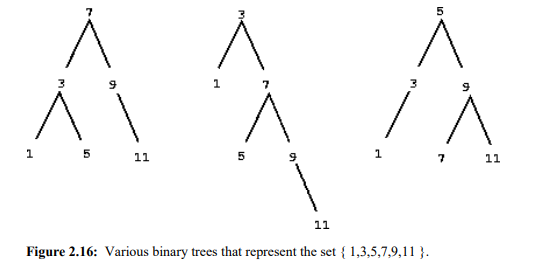
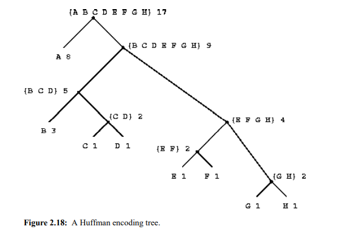
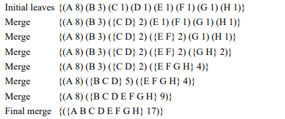
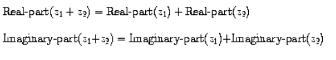
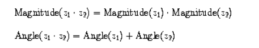
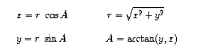

# Chapter 2 

# Buiding Abstractions with data

In this chapter we are going to look at more complex data. Programs are typically designed to model complex phenomena, and more often than  not one must construct computational objects that have several parts in order to model real-world  phenomena that have several aspects.  we turn in this chapter to another key aspect of  any programming language: the means it provides for building abstractions by combining data objects to  form **compound data** 

## 2.1 Introduction to Data Abstractions

### 2.1.1 Example:Arithmetic Operations for Rational Numbers

- `(make-rat <n> <d>)` returns the rational number whose numerator is the integer `<n>` and  whose denominator is the integer`<d>` .  
- `(numer <x>) `returns the numerator of the rational number `<x>`.
- `  (denom <x>) `returns the denominator of the rational number `<x>`.

We are using here a powerful strategy of synthesis: **wishful thinking**.  
$$
\frac{n_1}{d_1} + \frac{n2}{d2} = \frac{n_1d_2+n_2d_1}{d_1d_2} \\
\frac{n_1}{d_1} - \frac{n_2}{d_2}  = \frac{n_1d_2 - n_2d_1}{d_1d_2}\\
\frac{n_1}{d_1} *\frac{n_2}{d_2} = \frac{n_1n_2}{d_1d_2} \\
\frac{n_1/d_1}{n_2/d_2} = \frac{n_1d_2}{d_1n_2}\\
\frac{n_1}{d_1} = \frac{n_2}{d_2} \text{ if and only if } n_1d_2 = n_2d_1
$$
We can express these rules as procedures 

```lisp
(define (add-rat x y)
 (make-rat (+ (* (numer x) (denom y))
 (* (numer y) (denom x)))
 (* (denom x) (denom y))))
(define (sub-rat x y)
 (make-rat (- (* (numer x) (denom y))
 (* (numer y) (denom x)))
 (* (denom x) (denom y))))
(define (mul-rat x y)
 (make-rat (* (numer x) (numer y))
 (* (denom x) (denom y))))
(define (div-rat x y)
 (make-rat (* (numer x) (denom y))
 (* (denom x) (numer y))))
(define (equal-rat? x y)
 (= (* (numer x) (denom y))
 (* (numer y) (denom x)))
```

#### Pairs

To enable us to implement the concrete level of our data abstraction, our language provides a compound  structure called a **pair**, which can be constructed with the primitive procedure cons. This procedure takes  two arguments and returns a compound data object that contains the two arguments as parts. Given a pair,  we can extract the parts using the primitive procedures **car** and **cdr**. 2 Thus, we can use **cons**, **car**, and  **cdr** as follows.

#### Representing rational numbers

 Simply represent a rational number as a  pair of two integers: a numerator and a denominator. we can print rational numbers by printing the  numerator, a slash, and the denominator: 

```lisp
(define (print-rat x)
 (newline)
 (display (numer x))
 (display "/")
 (display (denom x)))
```

But our rational-number implementation does not reduce rational numbers to  lowest terms , we can use gcd to reduce the  numerator and the denominator to lowest terms before constructing the pair .

```lisp
(define (make-rat n d)
 	(let ((g (gcd n d)))
 	 	(cons (/ n g) (/ d g))))
```

### 2.1.2Abstraction Barriers

 In effect, procedures at each level are the interfaces that  define the abstraction barriers and connect the different levels. 


### 2.1.3 What is Meant by Data?

 In other words, make-rat, numer, and denom must  satisfy the condition that, for any integer n and any non-zero integer d, if x is (make-rat n d), then 
$$
\frac{\text{(number x)}}{\text{(demon x)}} = \frac{n} {d}
$$
In fact, this is the only condition make-rat, numer, and denom must fulfill in order to form a suitable  basis for a rational-number representation. In general, we can think of data as defined by some collection  of selectors and constructors, together with specified conditions that these procedures must fulfill in order  to be a valid representation 

```lisp
(define (cons x y)
	(define (dispatch m)
		(cond ((= m 0) x)
 			  ((= m 1) y)
 			  (else (error "Argument not 0 or 1 -- CONS" m))))
 	dispatch)
 	
(define (car z) (z 0))

(define (cdr z) (z 1))
```

This use of procedures corresponds to nothing like our intuitive notion of what data should be.  Nevertheless, all we need to do to show that this is a valid way to represent pairs is to verify that these  procedures satisfy the condition given above.

This example also demonstrates that the  ability to manipulate procedures as objects automatically provides the ability to represent compound data. 

 This style of programming is often called **message passing,** and we will be using  it as a basic tool in chapter 3 when we address the issues of modeling and simulation.

### 2.1.4 Extend Exercise: Interval Arithmetic

Alyssa's idea is to implement "**interval arithmetic**'' as a set of arithmetic operations for combining  "**intervals**'' (objects that represent the range of possible values of an inexact quantity). The result of adding,  subtracting, multiplying, or dividing two intervals is itself an interval, representing the range of the result. 

```lisp
(define (add-interval x y)
 (make-interval (+ (lower-bound x) (lower-bound y))
 (+ (upper-bound x) (upper-bound y))))
```

```lisp
(define (mul-interval x y)
 (let ((p1 (* (lower-bound x) (lower-bound y)))
 (p2 (* (lower-bound x) (upper-bound y)))
 (p3 (* (upper-bound x) (lower-bound y)))
 (p4 (* (upper-bound x) (upper-bound y))))
 (make-interval (min p1 p2 p3 p4)
 (max p1 p2 p3 p4))))
```

## 2.2 Hierarchical Data and the Closure property

In this  representation, which is called **box-and-pointer notation**, each object is shown as a pointer to a box. 


Closure is the key to power in any means of  combination because it permits us to create **hierarchical structures** -- structures made up of parts, which  themselves are made up of parts, and so on. 

### 2.2.1 Representing Sequences

One of the useful structures we can build with pairs is a **sequence** ——an ordered collection of data objects .The **car** of each pair is the corresponding item in the chain, and the **cdr** of the pair is the next pair in the  chain. The **cdr** of the final pair signals the end of the sequence by pointing to a distinguished value that is  not a pair, represented in box-and-pointer diagrams as a diagonal line and in programs as the value of the  variable nil. The entire sequence is constructed by nested cons operations 

```lisp
(cons 1
	(cons 2
		(cons 3 
			(cons 4 nil ))))
```

Such a sequence of pairs, formed by nested **conses**, is called a **list**.
$$
\text{(list <a1> <a2> <a3>...<an>)}
$$
is equivalent to 
$$
\text{(cons <a1> (cons <a2> (cons ... (cons <an> nil)...)))}
$$
We can think of **car** as selecting the **first item** in the list, and of **cdr** as selecting the **sublist** consisting of  all but the first item. The value of **nil**, used to terminate the chain of pairs, can be thought of as a sequence of no elements, the  **empty list.** The word **nil** is a contraction of the Latin word nihil, which means "nothing". 

#### List Operations

**list-ref** takes as arguments a list and a number n and returns the **nth** item of the list.

- For $n = 0$ ,list-ref should return the **car** of the list
- Otherwise, list-ref should return the (n - 1)st item of the **cdr** of the list.

```lisp
(define (list-ref items n)
	(if (= n 0)
		(car items)
		(list-ref (cdr items) (- n 1))))
(define squares (list 1 4 9 16 25))

(list-ref squares 3)
```

The procedure **length**, which returns the number of items in a  list, illustrates this typical pattern of use:

```lisp
(define (length items)
	(if (null? items)
		0
		(+ 1 (length (cdr items)))))
(define odds (list 1 3 5 7))

(length odds)
```

procedure step:

- The **length** of any list is 1 plus the **length** of the **cdr** of the list.
- The **length** of the empty list is 0.  

**Append** is also implemented using a recursive plan. To append lists list1 and list2, do the  following: 

- If  **list1** is the empty list, then the result is just **list2** 
- Otherwise, **append** the **cdr** of **list1** and **list2**, and **cons** the **car** of **list1** onto the result:  

```lisp
(define (append list1 list2)
	(if (null? list1)
		list2
		(cons (car list1) (append (cdr list1) list2))))
```

#### Mapping over lists

One extremely useful operation is to apply some transformation to each element in a list and generate the  list of results. For instance, the following procedure scales each number in a list by a given factor 

```lisp
(define (scale-list items factor)
 (if (null? items)
 nil
 (cons (* (car items) factor)
 (scale-list (cdr items) factor))))
(scale-list (list 1 2 3 4 5) 10)
(10 20 30 40 50)
```

We can abstract this general idea and capture it as a common pattern expressed as a higher-order procedure 

```lisp
(define (map proc items)
	(if (null? items)
		nil
		(cons (proc (car items))
			  (map proc (cdr items)))))
```

Now we can give a new definition of scale-list in terms of map:  

```lisp
(define (scale-list items factor)
	(map (lambda (x) (* x factor))
		  items))
```

### 2.2.2 Hierarchical Structures

`(cons (list 1 2) (list 3 4)) `


Another way to think of sequences whose elements are sequences is as trees. 


 Recursion is a natural tool for dealing with tree structures, since we can often reduce operations on trees to  operations on their branches, which reduce in turn to operations on the branches of the branches, and so on,  until we reach the leaves of the tree.  

To implement count-leaves, recall the recursive plan for computing length: 

- **Length** of a list x is 1 plus length of the **cdr** of x. 
- **Length** of the empty list is 0.  

```lisp
(define (count-leaves x)
	(cond ((null? x) 0) 
		((not (pair? x)) 1)	
		(else (+ (count-leaves (car x))
				 (count-leaves (cdr x))))))
```

#### Mapping over trees

Just as **map** is a powerful abstraction for dealing with sequences, map together with recursion is a powerful  abstraction for dealing with trees.The recursive plan for **scale-tree** is  similar to the one for **count-leaves**: 

```lisp
(define (scale-tree tree factor)
	(cond ((null? tree) nil)
		((not (pair? tree)) (* tree factor))
		(else (cons (scale-tree (car tree) factor)
					(scale-tree (cdr tree) factor)))))
					
(scale-tree (list 1 (list 2 (list 3 4) 5) (list 6 7))
 10)
(10 (20 (30 40) 50) (60 70))
```

Another way to implement scale-tree is to regard the tree as a sequence of sub-trees and use map. We  map over the sequence, scaling each sub-tree in turn, and return the list of results. In the base case, where  the tree is a leaf, we simply multiply by the factor:

```lisp
(define (scale-tree tree factor)
	(map (lambda (sub-tree)
		(if (pair? sub-tree)
			(scale-tree sub-tree factor)
			(* sub-tree factor)))
 		tree))
```

### 2.2.3 Sequences as Conventional Interfaces

Our  two procedures decompose the computations in a different way, spreading the enumeration over the  program and mingling it with the map, the filter, and the accumulation. If we could organize our programs  to make the signal-flow structure manifest in the procedures we write, this would increase the conceptual  clarity of the resulting code. 

#### Sequences Operations

Filtering a sequence to select only those elements that satisfy a given predicate is accomplished by 

```lisp
(define (filter predicate sequence)
	(cond ((null? sequence) nil)
		((predicate (car sequence))
		 (cons (car sequence)
 				(filter predicate (cdr sequence))))
 		(else (filter predicate (cdr sequence)))))
```

Accumulations can be implemented by  

```lisp
(define (accumulate op initial sequence)
	(if (null? sequence)
		initial
		(op (car sequence)
 			(accumulate op initial (cdr sequence)))))
```

​	 We can  encourage modular design by providing a library of standard components together with a conventional  interface for connecting the components in flexible ways. 

​	Modular construction is a powerful strategy for controlling complexity in engineering design. In real signal,processing applications, for example, designers regularly build systems by cascading elements selected  from standardized families of filters and transducers. Similarly, sequence operations provide a library of  tandard program elements that we can mix and match. 

Sequences, implemented here as lists, serve as a conventional interface that permits us to combine  processing modules. Additionally, when we uniformly represent structures as sequences, we have localized  the data-structure dependencies in our programs to a small number of sequence operations. By changing  these, we can experiment with alternative representations of sequences, while leaving the overall design of  our programs intact.

#### Nested Mappings

 Given a positive integer n, find all ordered pairs of distinct positive  integers i and j, where 1< j< i< n, such that i + j is prime. For example, if n is 6, then the pairs are the  following: 


For each i in this sequence, we map along the sequence `(enumerate- interval 1 (- i 1)) `we generate the pair `(list i j)`. This  gives us a sequence of pairs for each i. 

```lisp
(accumulate append
 			nil
 			(map (lambda (i)
 					(map (lambda (j) (list i j))
 						(enumerate-interval 1 (- i 1))))
 					(enumerate-interval 1 n)))
```

The combination of mapping and accumulating with append is so common in this sort of program that we  will isolate it as a separate procedure:  

```lisp
(define (flatmap proc seq)
 	(accumulate append nil (map proc seq)))
```

Nested mappings are also useful for sequences other than those that enumerate intervals 

```lisp
(define (permutations s)
	(if (null? s) ; 			empty set?
		(list nil) ; 			sequence containing empty set
 		(flatmap (lambda (x)
 				(map (lambda (p) (cons x p))
 					 (permutations (remove x s))))
 				s)))
```

The remove procedure used in permutations returns  all the items in a given sequence except for a given item. This can be expressed as a simple filter: 

```lisp
(define (remove item sequence)
		(filter (lambda (x) (not (= x item)))
 			sequence))
```

## 2.3 Symbolic Data

​	In this  section we extend the representational capability of our language by introducing the ability to work with  arbitrary symbols as data. 

#### 2.3.1 Quotation

In order to manipulate symbols we need a new element in our language: the ability to quote a data object. (traditionally, the single quote symbol `'`) only at the beginning of the  object to be quoted. In keeping with this, we can obtain the empty list by evaluating `'()`, and thus dispense with the variable  `nil`

 One additional primitive used in manipulating symbols is eq?, which takes two symbols as arguments and  tests whether they are the same.35 Using eq?, we can implement a useful procedure called memq. This  takes two arguments, a symbol and a list. If the symbol is not contained in the list (i.e., is not eq? to any  item in the list), then memq returns false. 

```lisp
(define (memq item x)
	(cond ((null? x) false)
		((eq? item (car x)) x)
		(else (memq item (cdr x)))))
```

### 2.3.2 Example:Symbolic Differentiation

As an illustration of symbol manipulation and a further illustration of data abstraction, consider the design  of a procedure that performs symbolic differentiation of algebraic expressions. We would like the  procedure to take as arguments an algebraic expression and a variable and to return the derivative of the  expression with respect to the variable 

##### The differentiation program with abstract data

Differentiation of any such expression can be carried out by applying the following reduction  rules :


That is, to obtain the derivative of a sum we first  find the derivatives of the terms and add them. Each of the terms may in turn be an expression that needs to  be decomposed .

Let us  assume that we already have procedures to implement the following selectors, constructors, and predicates: 


Using these, and the primitive predicate number?, which identifies numbers, we can express the  differentiation rules as the following procedure: 

```lisp
(define (deriv exp var)
	(cond ((number? exp) 0)
		((variable? exp)
		 (if (same-variable? exp var) 1 0))
		((sum? exp)
		 (make-sum (deriv (addend exp) var)
				   (deriv (augend exp) var)))
		 ((product? exp)
		   (make-sum
			(make-product (multiplier exp)
 						  (deriv (multiplicand exp) var))
			(make-product (deriv (multiplier exp) var)
						  (multiplicand exp))))
 		  (else
 			(error "unknown expression type -- DERIV" exp))))
```

This $deriv$ procedure incorporates the complete differentiation algorithm. 

#### Repersenting algebraic expressions

we will use the same parenthesized prefix notation that Lisp  uses for combinations;Then our data representation for  the differentiation problem is as follows :


The program produces answers that are correct; however, they are unsimplified 

```lisp
(define (make-sum a1 a2)
	(cond ((=number? a1 0) a2)
		  ((=number? a2 0) a1)
 		  ((and (number? a1) (number? a2)) (+ a1 a2))
 		  (else (list '+ a1 a2))))
```

Similarly, we will change make-product to build in the rules that 0 times anything is 0 and 1 times  anything is the thing itself 

```lisp
(define (make-product m1 m2)
	(cond ((or (=number? m1 0) (=number? m2 0)) 0)
 		  ((=number? m1 1) m2)
		  ((=number? m2 1) m1)
		  ((and (number? m1) (number? m2)) (* m1 m2))
		  (else (list '* m1 m2))))
```

Although this is quite an improvement,  there is still a long way to go before  we get a program that puts expressions into a form that we might agree is ``simplest.'' The problem of  algebraic simplification is complex because, among other reasons, a form that may be simplest for one  purpose may not be for another. 

### 2.3.3 Example: Representing Sets

Informally, a set is simply a collection of distinct objects. To give a more precise definition we can employ  the method of data abstraction. That is, we define "set'' by specifying the operations that are to be used on  sets. These are union-set, intersection-set, element-of-set?, and adjoin-set.  Element-of-set? is a predicate that determines whether a given element is a member of a set.  Adjoin-set takes an object and a set as arguments and returns a set that contains the elements of the  original set and also the adjoined element. Union-set computes the union of two sets, which is the set  containing each element that appears in either argument. Intersection-set computes the intersection  of two sets, which is the set containing only elements that appear in both arguments. 

#### Sets as Unordered lists

```lisp
(define (element-of-set? x set)
 (cond ((null? set) false)
 ((equal? x (car set)) true)
 (else (element-of-set? x (cdr set)))))
```

Using this, we can write `adjoin-set `

```lisp
(define (adjoin-set x set)
 (if (element-of-set? x set)
 set
 (cons x set)))
```

If we know how to form the intersection of  set2 and the cdr of set1, we only need to decide whether to include the car of set1 in this. But this  depends on whether (car set1) is also in set2. Here is the resulting procedure: 

```lisp
(define (intersection-set set1 set2)
 (cond ((or (null? set1) (null? set2)) '())
 ((element-of-set? (car set1) set2) 
 (cons (car set1)
 (intersection-set (cdr set1) set2)))
 (else (intersection-set (cdr set1) set2))))
```

#### Sets as ordered lists

One way to speed up our set operations is to change the representation so that the set elements are listed in  increasing order.To keep our discussion simple, we will consider only the case where the set elements are  numbers, so that we can compare elements using > and <.  

```lisp
(define (element-of-set? x set)
 (cond ((null? set) false)
 ((= x (car set)) true)
 ((< x (car set)) false)
 (else (element-of-set? x (cdr set)))))
```

This is still $\Theta (n)$ growth, but it does save us, on the average, a factor of  2 in number of steps over the previous implementation.Begin by comparing the initial  elements, x1 and x2, of the two sets. If x1 equals x2, then that gives an element of the intersection, and  the rest of the intersection is the intersection of the cdrs of the two sets. Suppose, however, that x1 is less  than x2. Since x2 is the smallest element in set2, we can immediately conclude that x1 cannot appear  anywhere in set2 and hence is not in the intersection.  

```lisp
(define (intersection-set set1 set2)
 	(if (or (null? set1) (null? set2))
 		'() 
 		(let ((x1 (car set1)) (x2 (car set2)))
 		 (cond ((= x1 x2)
 			 	(cons x1
 					(intersection-set (cdr set1)
 										(cdr set2))))
 				((< x1 x2)
 					(intersection-set (cdr set1) set2))
 				((< x2 x1)
 					(intersection-set set1 (cdr set2)))))))
```

#### Sets as binary trees

The only thing  we require for a valid representation is that all elements in the left subtree be smaller than the node entry  and that all elements in the right subtree be larger 



Thus, in one step we have  reduced the problem of searching a tree of size n to searching a tree of size n/2. Since the size of the tree is  halved at each step, we should expect that the number of steps needed to search a tree of size n grows as  $\Theta (log n) $

We can represent trees by using lists. Each node will be a list of three items: the entry at the node, the left  subtree, and the right subtree. A left or a right subtree of the empty list will indicate that there is no subtree  connected there. We can describe this representation by the following procedures: 

```lisp
(define (entry tree) (car tree))
(define (left-branch tree) (cadr tree))
(define (right-branch tree) (caddr tree))
(define (make-tree entry left right)
 (list entry left right))
```

Now we can write the `element-of-set?` procedure using the strategy described above: 

```lisp
(define (element-of-set? x set)
 (cond ((null? set) false)
 ((= x (entry set)) true)
 ((< x (entry set))
 (element-of-set? x (left-branch set)))
 ((> x (entry set))
 (element-of-set? x (right-branch set)))))
```

 If x is equal to the entry, we just return the node. If we are asked to  adjoin x to an empty tree, we generate a tree that has x as the entry and empty right and left branches. Here  is the procedure 

```lisp
(define (adjoin-set x set)
 (cond ((null? set) (make-tree x '() '()))
 ((= x (entry set)) set)
 ((< x (entry set))
 (make-tree (entry set) 
 (adjoin-set x (left-branch set))
 (right-branch set)))
 ((> x (entry set))
 (make-tree (entry set)
 (left-branch set)
 (adjoin-set x (right-branch set))))))
```

#### Sets and information retrieval

We have examined options for using lists to represent sets and have seen how the choice of representation  for a data object can have a large impact on the performance of the programs that use the data. Another  reason for concentrating on sets is that the techniques discussed here appear again and again in applications  involving information retrieval. 

Now we represent the data base as a set of records. To locate the record with a given key we use a  procedure lookup, which takes as arguments a key and a data base and which returns the record that has  that key, or false if there is no such record. Lookup is implemented in almost the same way as elementof-set?. For example, if the set of records is implemented as an unordered list, we could use 

```lisp
(define (lookup given-key set-of-records)
 (cond ((null? set-of-records) false)
 ((equal? given-key (key (car set-of-records)))
 (car set-of-records))
 (else (lookup given-key (cdr set-of-records)))))
```

### 2.3.4 Example: Huffman Encoding Trees

This section provides practice in the use of list structure and data abstraction to manipulate sets and trees.  The application is to methods for representing data as sequences of ones and zeros (bits). In general, if we  want to distinguish n different symbols, we will need to use $log_2 n$ bits per symbol.

It is sometimes advantageous to use  variable-length codes, in which different symbols may be represented by different numbers of bits.  

One of the difficulties of using a variable-length code is knowing when you have reached the end of a  symbol in reading a sequence of zeros and ones. Morse code solves this problem by using a special  separator code (in this case, a pause) after the sequence of dots and dashes for each letter. Another solution  is to design the code in such a way that no complete code for any symbol is the beginning (or prefix) of the  code for another symbol. Such a code is called a **prefix code** 

Given a Huffman tree, we can find the encoding of any symbol by starting at the root and moving down  until we reach the leaf that holds the symbol. Each time we move down a left branch we add a 0 to the  code, and each time we move down a right branch we add a 1. (We decide which branch to follow by  testing to see which branch either is the leaf node for the symbol or contains the symbol in its set.)  



#### Generating Huffman Trees

The idea is to arrange the tree so that the  symbols with the lowest frequency appear farthest away from the root. Begin with the set of leaf nodes,  containing symbols and their frequencies, as determined by the initial data from which the code is to be  constructed. Now find two leaves with the lowest weights and merge them to produce a node that has these  two nodes as its left and right branches. The weight of the new node is the sum of the two weights. Remove  the two leaves from the original set and replace them by this new node. Now continue this process. At each  step, merge two nodes with the smallest weights, removing them from the set and replacing them with a  node that has these two as its left and right branches. The process stops when there is only one node left,  which is the root of the entire tree. 



#### Representing Huffman trees

we will work with a system that uses Huffman trees to encode and decode messages  and generates Huffman trees according to the algorithm outlined above. We will begin by discussing how  trees are represented.

Leaves of the tree are represented by a list consisting of the symbol leaf, the symbol at the leaf, and the  weight 

```lisp
(define (make-leaf symbol weight)
 (list 'leaf symbol weight))
(define (leaf? object)
 (eq? (car object) 'leaf))
(define (symbol-leaf x) (cadr x))
(define (weight-leaf x) (caddr x))
```

we make a tree by merging two nodes, we obtain the weight of the tree as the sum of the weights of the  nodes, and the set of symbols as the union of the sets of symbols for the nodes.  

```lisp
(define (make-code-tree left right)
 (list left
 right
 (append (symbols left) (symbols right))
 (+ (weight left) (weight right))))
```

If we make a tree in this way, we have the following selectors 

```lisp
(define (left-branch tree) (car tree))
(define (right-branch tree) (cadr tree))
(define (symbols tree)
 (if (leaf? tree)
 (list (symbol-leaf tree))
 (caddr tree)))
(define (weight tree)
 (if (leaf? tree)
 (weight-leaf tree)
 (cadddr tree)))
```

#### The decoding procedure

The following procedure implements the decoding algorithm 

```lisp
(define (decode bits tree)
 (define (decode-1 bits current-branch)
 (if (null? bits)
 '()
 (let ((next-branch
 (choose-branch (car bits) current-branch)))
 (if (leaf? next-branch)
 (cons (symbol-leaf next-branch)
 (decode-1 (cdr bits) tree))
 (decode-1 (cdr bits) next-branch)))))
 (decode-1 bits tree))
(define (choose-branch bit branch)
 (cond ((= bit 0) (left-branch branch))
 ((= bit 1) (right-branch branch))
 (else (error "bad bit -- CHOOSE-BRANCH" bit))))
```

#### Sets of weighed elements

We will represent a set of leaves and trees as a list of elements, arranged in increasing order of weight. The  following adjoin-set procedure for constructing sets is similar to the one described in exercise 2.61;  however, items are compared by their weights, and the element being added to the set is never already in it. 

```lisp
(define (adjoin-set x set)
 (cond ((null? set) (list x))
 ((< (weight x) (weight (car set))) (cons x set))
 (else (cons (car set)
 (adjoin-set x (cdr set))))))
```

The following procedure takes a list of symbol-frequency pairs and constructs an initial ordered set of leaves, ready to be merged according to the Huffman  algorithm: 

```
(define (make-leaf-set pairs)
 (if (null? pairs)
 '()
 (let ((pair (car pairs)))
 (adjoin-set (make-leaf (car pair) ; symbol
 (cadr pair)) ; frequency
 (make-leaf-set (cdr pairs))))))
```

## 2.4 Multiple Representations for Abstract Data

we saw in section 2.1.1 how to separate the task of designing a  program that uses rational numbers from the task of implementing rational numbers in terms of the  computer language's primitive mechanisms for constructing compound data. The key idea was to erect an  abstraction barrier -- in this case, the selectors and constructors for rational numbers (make-rat, numer,  denom) -- that isolates the way rational numbers are used from their underlying representation in terms of  list structure.  

These data-abstraction barriers are powerful tools for controlling complexity. By isolating the underlying  representations of data objects, we can divide the task of designing a large program into smaller tasks that  can be performed separately.  

More importantly, programming systems are often designed by many people working over extended  periods of time, subject to requirements that change over time.Furthermore,  since large programs are often created by combining pre-existing modules that were designed in isolation,  we need conventions that permit programmers to incorporate modules into larger systems additively, that  is, without having to redesign or reimplement these modules. 

that is, data objects that include explicit information  about how they are to be processed. We will also discuss **data-directed** programming, a powerful and  convenient implementation strategy for additively assembling systems with generic operations 

### 2.4.1 Representations for Complex Numbers

We begin by discussing two plausible  representations for complex numbers as ordered pairs: rectangular form (real part and imaginary part) and  polar form (magnitude and angle). 





As shown in the formulas above, we can add and subtract complex numbers in terms of real  and imaginary parts while multiplying and dividing complex numbers in terms of magnitudes and angles: 



which relate the real and imaginary parts (x, y) to the magnitude and the angle (r, A).Ben's representation  is therefore given by the following selectors and constructors: 

```lisp
(define (real-part z) (car z))
(define (imag-part z) (cdr z))
(define (magnitude z)
 (sqrt (+ (square (real-part z)) (square (imag-part z)))))
(define (angle z)
 (atan (imag-part z) (real-part z)))
(define (make-from-real-imag x y) (cons x y))
(define (make-from-mag-ang r a) 
 (cons (* r (cos a)) (* r (sin a))))
```

Alyssa, in contrast, chooses to represent complex numbers in polar form. For her, selecting the magnitude  and angle is straightforward, but she has to use the trigonometric relations to obtain the real and imaginary  parts. Alyssa's representation is: 

```lisp
(define (real-part z)
 (* (magnitude z) (cos (angle z))))
(define (imag-part z)
 (* (magnitude z) (sin (angle z))))
(define (magnitude z) (car z))
(define (angle z) (cdr z))
(define (make-from-real-imag x y) 
 (cons (sqrt (+ (square x) (square y)))
 (atan y x)))
(define (make-from-mag-ang r a) (cons r a))
```

### 2.4.2 Tagged data

A straightforward way to accomplish this distinction is to include a type tag -- the symbol  **rectangular** or **polar** -- as part of each complex number.  

In order to manipulate tagged data, we will assume that we have procedures type-tag and contents that extract from a data object the tag and the actual contents (the polar or rectangular coordinates, in the  case of a complex number). We will also postulate a procedure attach-tag that takes a tag and contents  and produces a tagged data object. A straightforward way to implement this is to use ordinary list structure: 

```lisp
(define (attach-tag type-tag contents)
 (cons type-tag contents))
(define (type-tag datum)
 (if (pair? datum)
 (car datum)
 (error "Bad tagged datum -- TYPE-TAG" datum)))
(define (contents datum)
 (if (pair? datum)
 (cdr datum)
 (error "Bad tagged datum -- CONTENTS" datum)))
```

### 2.4.3 Data-Directed Programming and Additivity

The general strategy of checking the type of a datum and calling an appropriate procedure is called  **dispatching on type**. 

What we need is a means for modularizing the system design even further. This is provided by the  programming technique known as **data-directed programming.**  

Data-directed programming is the technique of designing programs to work with such a table directly.  Previously, we implemented the mechanism that interfaces the complex-arithmetic code with the two  representation packages as a set of procedures that each perform an explicit dispatch on type. Here we will  implement the interface as a single procedure that looks up the combination of the operation name and  argument type in the table to find the correct procedure to apply, and then applies it to the contents of the  argument 

To implement this plan, assume that we have two procedures, put and get, for manipulating the  operation-and-type table:  

- `(put <op> <type> <item>)`

  installs the <item> in the table, indexed by the<op>  and the <type>.	

- `(get <op> <type>)`

  looks up the <op> ,  <type> entry in the table and returns the item found there. If no item is  found, get returns false.  

```lisp
(define (install-rectangular-package)
 ;; internal procedures
 (define (real-part z) (car z))
 (define (imag-part z) (cdr z))
 (define (make-from-real-imag x y) (cons x y))
 (define (magnitude z)
 (sqrt (+ (square (real-part z))
 (square (imag-part z)))))
 (define (angle z)
 (atan (imag-part z) (real-part z)))
 (define (make-from-mag-ang r a) 
 (cons (* r (cos a)) (* r (sin a))))
 ;; interface to the rest of the system
 (define (tag x) (attach-tag 'rectangular x))
 (put 'real-part '(rectangular) real-part)
 (put 'imag-part '(rectangular) imag-part)
 (put 'magnitude '(rectangular) magnitude)
 (put 'angle '(rectangular) angle)
 (put 'make-from-real-imag 'rectangular 
 (lambda (x y) (tag (make-from-real-imag x y))))
 (put 'make-from-mag-ang 'rectangular 
 (lambda (r a) (tag (make-from-mag-ang r a))))
 'done)
```

Notice that the internal procedures here are the same procedures from section 2.4.1 that Ben wrote when he  was working in isolation. 

Alyssa's polar package is analogous: 

```lisp
(define (install-polar-package)
 ;; internal procedures
 (define (magnitude z) (car z))
 (define (angle z) (cdr z))
 (define (make-from-mag-ang r a) (cons r a))
 (define (real-part z)
 (* (magnitude z) (cos (angle z))))
 (define (imag-part z)
 (* (magnitude z) (sin (angle z))))
 (define (make-from-real-imag x y) 
 (cons (sqrt (+ (square x) (square y)))
 (atan y x)))
 ;; interface to the rest of the system
 (define (tag x) (attach-tag 'polar x))
 (put 'real-part '(polar) real-part)
 (put 'imag-part '(polar) imag-part)
 (put 'magnitude '(polar) magnitude)
 (put 'angle '(polar) angle)
 (put 'make-from-real-imag 'polar
 (lambda (x y) (tag (make-from-real-imag x y))))
 (put 'make-from-mag-ang 'polar 
 (lambda (r a) (tag (make-from-mag-ang r a))))
 'done)
```

Even though Ben and Alyssa both still use their original procedures defined with the same names as each  other's (e.g., real-part), these definitions are now internal to different procedures (see section 1.1.8), so  there is no name conflict 