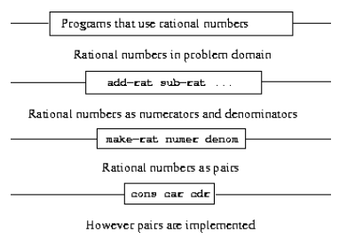
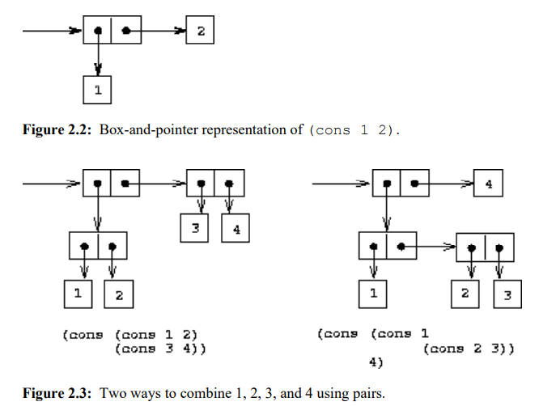
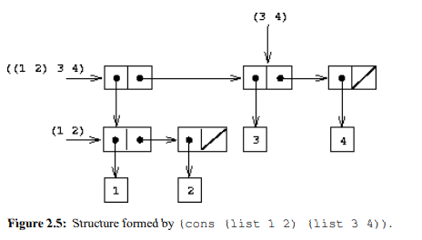
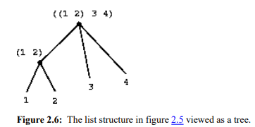
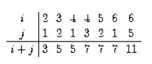
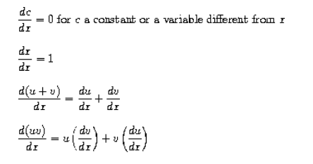
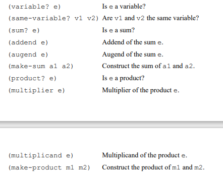
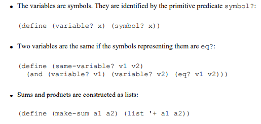
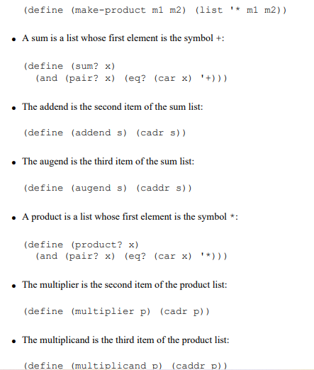

# Chapter 2 

# Buiding Abstractions with data

In this chapter we are going to look at more complex data. Programs are typically designed to model complex phenomena, and more often than  not one must construct computational objects that have several parts in order to model real-world  phenomena that have several aspects.  we turn in this chapter to another key aspect of  any programming language: the means it provides for building abstractions by combining data objects to  form **compound data** 

## 2.1 Introduction to Data Abstractions

### 2.1.1 Example:Arithmetic Operations for Rational Numbers

- `(make-rat <n> <d>)` returns the rational number whose numerator is the integer `<n>` and  whose denominator is the integer`<d>` .  
- `(numer <x>) `returns the numerator of the rational number `<x>`.
- `  (denom <x>) `returns the denominator of the rational number `<x>`.

We are using here a powerful strategy of synthesis: **wishful thinking**.  
$$
\frac{n_1}{d_1} + \frac{n2}{d2} = \frac{n_1d_2+n_2d_1}{d_1d_2} \\
\frac{n_1}{d_1} - \frac{n_2}{d_2}  = \frac{n_1d_2 - n_2d_1}{d_1d_2}\\
\frac{n_1}{d_1} *\frac{n_2}{d_2} = \frac{n_1n_2}{d_1d_2} \\
\frac{n_1/d_1}{n_2/d_2} = \frac{n_1d_2}{d_1n_2}\\
\frac{n_1}{d_1} = \frac{n_2}{d_2} \text{ if and only if } n_1d_2 = n_2d_1
$$
We can express these rules as procedures 

```lisp
(define (add-rat x y)
 (make-rat (+ (* (numer x) (denom y))
 (* (numer y) (denom x)))
 (* (denom x) (denom y))))
(define (sub-rat x y)
 (make-rat (- (* (numer x) (denom y))
 (* (numer y) (denom x)))
 (* (denom x) (denom y))))
(define (mul-rat x y)
 (make-rat (* (numer x) (numer y))
 (* (denom x) (denom y))))
(define (div-rat x y)
 (make-rat (* (numer x) (denom y))
 (* (denom x) (numer y))))
(define (equal-rat? x y)
 (= (* (numer x) (denom y))
 (* (numer y) (denom x)))
```

#### Pairs

To enable us to implement the concrete level of our data abstraction, our language provides a compound  structure called a **pair**, which can be constructed with the primitive procedure cons. This procedure takes  two arguments and returns a compound data object that contains the two arguments as parts. Given a pair,  we can extract the parts using the primitive procedures **car** and **cdr**. 2 Thus, we can use **cons**, **car**, and  **cdr** as follows.

#### Representing rational numbers

 Simply represent a rational number as a  pair of two integers: a numerator and a denominator. we can print rational numbers by printing the  numerator, a slash, and the denominator: 

```lisp
(define (print-rat x)
 (newline)
 (display (numer x))
 (display "/")
 (display (denom x)))
```

But our rational-number implementation does not reduce rational numbers to  lowest terms , we can use gcd to reduce the  numerator and the denominator to lowest terms before constructing the pair .

```lisp
(define (make-rat n d)
 	(let ((g (gcd n d)))
 	 	(cons (/ n g) (/ d g))))
```

### 2.1.2Abstraction Barriers

 In effect, procedures at each level are the interfaces that  define the abstraction barriers and connect the different levels. 




### 2.1.3 What is Meant by Data?

 In other words, make-rat, numer, and denom must  satisfy the condition that, for any integer n and any non-zero integer d, if x is (make-rat n d), then 
$$
\frac{\text{(number x)}}{\text{(demon x)}} = \frac{n} {d}
$$
In fact, this is the only condition make-rat, numer, and denom must fulfill in order to form a suitable  basis for a rational-number representation. In general, we can think of data as defined by some collection  of selectors and constructors, together with specified conditions that these procedures must fulfill in order  to be a valid representation 

```lisp
(define (cons x y)
	(define (dispatch m)
		(cond ((= m 0) x)
 			  ((= m 1) y)
 			  (else (error "Argument not 0 or 1 -- CONS" m))))
 	dispatch)
 	
(define (car z) (z 0))

(define (cdr z) (z 1))
```

This use of procedures corresponds to nothing like our intuitive notion of what data should be.  Nevertheless, all we need to do to show that this is a valid way to represent pairs is to verify that these  procedures satisfy the condition given above.

This example also demonstrates that the  ability to manipulate procedures as objects automatically provides the ability to represent compound data. 

 This style of programming is often called **message passing,** and we will be using  it as a basic tool in chapter 3 when we address the issues of modeling and simulation.

### 2.1.4 Extend Exercise: Interval Arithmetic

Alyssa's idea is to implement "**interval arithmetic**'' as a set of arithmetic operations for combining  "**intervals**'' (objects that represent the range of possible values of an inexact quantity). The result of adding,  subtracting, multiplying, or dividing two intervals is itself an interval, representing the range of the result. 

```lisp
(define (add-interval x y)
 (make-interval (+ (lower-bound x) (lower-bound y))
 (+ (upper-bound x) (upper-bound y))))
```

```lisp
(define (mul-interval x y)
 (let ((p1 (* (lower-bound x) (lower-bound y)))
 (p2 (* (lower-bound x) (upper-bound y)))
 (p3 (* (upper-bound x) (lower-bound y)))
 (p4 (* (upper-bound x) (upper-bound y))))
 (make-interval (min p1 p2 p3 p4)
 (max p1 p2 p3 p4))))
```

## 2.2 Hierarchical Data and the Closure property

In this  representation, which is called **box-and-pointer notation**, each object is shown as a pointer to a box. 



Closure is the key to power in any means of  combination because it permits us to create **hierarchical structures** -- structures made up of parts, which  themselves are made up of parts, and so on. 

### 2.2.1 Representing Sequences

One of the useful structures we can build with pairs is a **sequence** ——an ordered collection of data objects .The **car** of each pair is the corresponding item in the chain, and the **cdr** of the pair is the next pair in the  chain. The **cdr** of the final pair signals the end of the sequence by pointing to a distinguished value that is  not a pair, represented in box-and-pointer diagrams as a diagonal line and in programs as the value of the  variable nil. The entire sequence is constructed by nested cons operations 

```lisp
(cons 1
	(cons 2
		(cons 3 
			(cons 4 nil ))))
```

Such a sequence of pairs, formed by nested **conses**, is called a **list**.
$$
\text{(list <a1> <a2> <a3>...<an>)}
$$
is equivalent to 
$$
\text{(cons <a1> (cons <a2> (cons ... (cons <an> nil)...)))}
$$
We can think of **car** as selecting the **first item** in the list, and of **cdr** as selecting the **sublist** consisting of  all but the first item. The value of **nil**, used to terminate the chain of pairs, can be thought of as a sequence of no elements, the  **empty list.** The word **nil** is a contraction of the Latin word nihil, which means "nothing". 

#### List Operations

**list-ref** takes as arguments a list and a number n and returns the **nth** item of the list.

- For $n = 0$ ,list-ref should return the **car** of the list
- Otherwise, list-ref should return the (n - 1)st item of the **cdr** of the list.

```lisp
(define (list-ref items n)
	(if (= n 0)
		(car items)
		(list-ref (cdr items) (- n 1))))
(define squares (list 1 4 9 16 25))

(list-ref squares 3)
```

The procedure **length**, which returns the number of items in a  list, illustrates this typical pattern of use:

```lisp
(define (length items)
	(if (null? items)
		0
		(+ 1 (length (cdr items)))))
(define odds (list 1 3 5 7))

(length odds)
```

procedure step:

- The **length** of any list is 1 plus the **length** of the **cdr** of the list.
- The **length** of the empty list is 0.  

**Append** is also implemented using a recursive plan. To append lists list1 and list2, do the  following: 

- If  **list1** is the empty list, then the result is just **list2** 
- Otherwise, **append** the **cdr** of **list1** and **list2**, and **cons** the **car** of **list1** onto the result:  

```lisp
(define (append list1 list2)
	(if (null? list1)
		list2
		(cons (car list1) (append (cdr list1) list2))))
```

#### Mapping over lists

One extremely useful operation is to apply some transformation to each element in a list and generate the  list of results. For instance, the following procedure scales each number in a list by a given factor 

```lisp
(define (scale-list items factor)
 (if (null? items)
 nil
 (cons (* (car items) factor)
 (scale-list (cdr items) factor))))
(scale-list (list 1 2 3 4 5) 10)
(10 20 30 40 50)
```

We can abstract this general idea and capture it as a common pattern expressed as a higher-order procedure 

```lisp
(define (map proc items)
	(if (null? items)
		nil
		(cons (proc (car items))
			  (map proc (cdr items)))))
```

Now we can give a new definition of scale-list in terms of map:  

```lisp
(define (scale-list items factor)
	(map (lambda (x) (* x factor))
		  items))
```

### 2.2.2 Hierarchical Structures

`(cons (list 1 2) (list 3 4)) `



Another way to think of sequences whose elements are sequences is as trees. 



 Recursion is a natural tool for dealing with tree structures, since we can often reduce operations on trees to  operations on their branches, which reduce in turn to operations on the branches of the branches, and so on,  until we reach the leaves of the tree.  

To implement count-leaves, recall the recursive plan for computing length: 

- **Length** of a list x is 1 plus length of the **cdr** of x. 
- **Length** of the empty list is 0.  

```lisp
(define (count-leaves x)
	(cond ((null? x) 0) 
		((not (pair? x)) 1)	
		(else (+ (count-leaves (car x))
				 (count-leaves (cdr x))))))
```

#### Mapping over trees

Just as **map** is a powerful abstraction for dealing with sequences, map together with recursion is a powerful  abstraction for dealing with trees.The recursive plan for **scale-tree** is  similar to the one for **count-leaves**: 

```lisp
(define (scale-tree tree factor)
	(cond ((null? tree) nil)
		((not (pair? tree)) (* tree factor))
		(else (cons (scale-tree (car tree) factor)
					(scale-tree (cdr tree) factor)))))
					
(scale-tree (list 1 (list 2 (list 3 4) 5) (list 6 7))
 10)
(10 (20 (30 40) 50) (60 70))
```

Another way to implement scale-tree is to regard the tree as a sequence of sub-trees and use map. We  map over the sequence, scaling each sub-tree in turn, and return the list of results. In the base case, where  the tree is a leaf, we simply multiply by the factor:

```lisp
(define (scale-tree tree factor)
	(map (lambda (sub-tree)
		(if (pair? sub-tree)
			(scale-tree sub-tree factor)
			(* sub-tree factor)))
 		tree))
```

### 2.2.3 Sequences as Conventional Interfaces

Our  two procedures decompose the computations in a different way, spreading the enumeration over the  program and mingling it with the map, the filter, and the accumulation. If we could organize our programs  to make the signal-flow structure manifest in the procedures we write, this would increase the conceptual  clarity of the resulting code. 

#### Sequences Operations

Filtering a sequence to select only those elements that satisfy a given predicate is accomplished by 

```lisp
(define (filter predicate sequence)
	(cond ((null? sequence) nil)
		((predicate (car sequence))
		 (cons (car sequence)
 				(filter predicate (cdr sequence))))
 		(else (filter predicate (cdr sequence)))))
```

Accumulations can be implemented by  

```lisp
(define (accumulate op initial sequence)
	(if (null? sequence)
		initial
		(op (car sequence)
 			(accumulate op initial (cdr sequence)))))
```

​	 We can  encourage modular design by providing a library of standard components together with a conventional  interface for connecting the components in flexible ways. 

​	Modular construction is a powerful strategy for controlling complexity in engineering design. In real signal,processing applications, for example, designers regularly build systems by cascading elements selected  from standardized families of filters and transducers. Similarly, sequence operations provide a library of  tandard program elements that we can mix and match. 

Sequences, implemented here as lists, serve as a conventional interface that permits us to combine  processing modules. Additionally, when we uniformly represent structures as sequences, we have localized  the data-structure dependencies in our programs to a small number of sequence operations. By changing  these, we can experiment with alternative representations of sequences, while leaving the overall design of  our programs intact.

#### Nested Mappings

 Given a positive integer n, find all ordered pairs of distinct positive  integers i and j, where 1< j< i< n, such that i + j is prime. For example, if n is 6, then the pairs are the  following: 



For each i in this sequence, we map along the sequence `(enumerate- interval 1 (- i 1)) `we generate the pair `(list i j)`. This  gives us a sequence of pairs for each i. 

```lisp
(accumulate append
 			nil
 			(map (lambda (i)
 					(map (lambda (j) (list i j))
 						(enumerate-interval 1 (- i 1))))
 					(enumerate-interval 1 n)))
```

The combination of mapping and accumulating with append is so common in this sort of program that we  will isolate it as a separate procedure:  

```lisp
(define (flatmap proc seq)
 	(accumulate append nil (map proc seq)))
```

Nested mappings are also useful for sequences other than those that enumerate intervals 

```lisp
(define (permutations s)
	(if (null? s) ; 			empty set?
		(list nil) ; 			sequence containing empty set
 		(flatmap (lambda (x)
 				(map (lambda (p) (cons x p))
 					 (permutations (remove x s))))
 				s)))
```

The remove procedure used in permutations returns  all the items in a given sequence except for a given item. This can be expressed as a simple filter: 

```lisp
(define (remove item sequence)
		(filter (lambda (x) (not (= x item)))
 			sequence))
```

## 2.3 Symbolic Data

​	In this  section we extend the representational capability of our language by introducing the ability to work with  arbitrary symbols as data. 

#### 2.3.1 Quotation

In order to manipulate symbols we need a new element in our language: the ability to quote a data object. (traditionally, the single quote symbol `'`) only at the beginning of the  object to be quoted. In keeping with this, we can obtain the empty list by evaluating `'()`, and thus dispense with the variable  `nil`

 One additional primitive used in manipulating symbols is eq?, which takes two symbols as arguments and  tests whether they are the same.35 Using eq?, we can implement a useful procedure called memq. This  takes two arguments, a symbol and a list. If the symbol is not contained in the list (i.e., is not eq? to any  item in the list), then memq returns false. 

```lisp
(define (memq item x)
	(cond ((null? x) false)
		((eq? item (car x)) x)
		(else (memq item (cdr x)))))
```

### 2.3.2 Example:Symbolic Differentiation

As an illustration of symbol manipulation and a further illustration of data abstraction, consider the design  of a procedure that performs symbolic differentiation of algebraic expressions. We would like the  procedure to take as arguments an algebraic expression and a variable and to return the derivative of the  expression with respect to the variable 

##### The differentiation program with abstract data

Differentiation of any such expression can be carried out by applying the following reduction  rules :



That is, to obtain the derivative of a sum we first  find the derivatives of the terms and add them. Each of the terms may in turn be an expression that needs to  be decomposed .

Let us  assume that we already have procedures to implement the following selectors, constructors, and predicates: 



Using these, and the primitive predicate number?, which identifies numbers, we can express the  differentiation rules as the following procedure: 

```lisp
(define (deriv exp var)
	(cond ((number? exp) 0)
		((variable? exp)
		 (if (same-variable? exp var) 1 0))
		((sum? exp)
		 (make-sum (deriv (addend exp) var)
				   (deriv (augend exp) var)))
		 ((product? exp)
		   (make-sum
			(make-product (multiplier exp)
 						  (deriv (multiplicand exp) var))
			(make-product (deriv (multiplier exp) var)
						  (multiplicand exp))))
 		  (else
 			(error "unknown expression type -- DERIV" exp))))
```

This $deriv$ procedure incorporates the complete differentiation algorithm. 

#### Repersenting algebraic expressions

we will use the same parenthesized prefix notation that Lisp  uses for combinations;Then our data representation for  the differentiation problem is as follows :





The program produces answers that are correct; however, they are unsimplified 

```lisp
(define (make-sum a1 a2)
	(cond ((=number? a1 0) a2)
		  ((=number? a2 0) a1)
 		  ((and (number? a1) (number? a2)) (+ a1 a2))
 		  (else (list '+ a1 a2))))
```

Similarly, we will change make-product to build in the rules that 0 times anything is 0 and 1 times  anything is the thing itself 

```lisp
(define (make-product m1 m2)
	(cond ((or (=number? m1 0) (=number? m2 0)) 0)
 		  ((=number? m1 1) m2)
		  ((=number? m2 1) m1)
		  ((and (number? m1) (number? m2)) (* m1 m2))
		  (else (list '* m1 m2))))
```

Although this is quite an improvement,  there is still a long way to go before  we get a program that puts expressions into a form that we might agree is ``simplest.'' The problem of  algebraic simplification is complex because, among other reasons, a form that may be simplest for one  purpose may not be for another. 